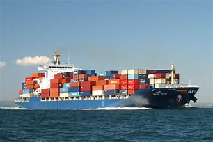
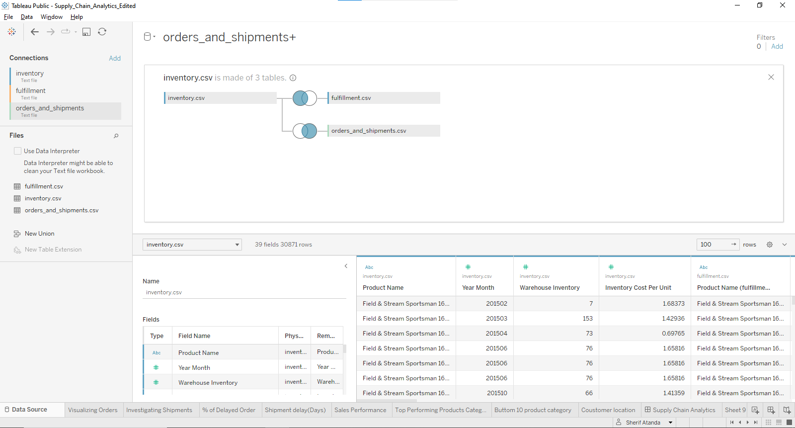
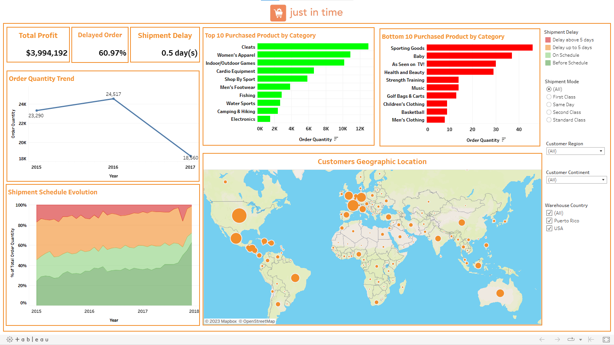

# Just_In_Time_Supply_Chain_Analytics

## INTRODUCTION

I decided to participate in Datacamp's second business intelligence competition and add it to my project portfolio. This is an excellent opportunity for data analysts to demonstrate their analytical abilities. More information about this competition is available at the website provided [here.](https://app.datacamp.com/learn/competitions/supply-chain-analytics)

## ABOUT THE DATASET
The dataset provided consist of four tables. The tables and the columns present therein can be found below:
- Orders and shipment: Order id, order item id, order year month, order year, order month, order day, order time, order quantity, product department, product category, product name, customer id, customer market, customer region, customer country, warehouse country, shipment year, shipment month, shipment day, shipment mode, shipment days scheduled, gross sales, discount percentage, profit.
- Inventory: Product name, year month, warehouse inventory, inventory cost per unit.
- Fulfilment: Product name, warehouse order fulfilment

## PROBLEM STATEMENT

Test your BI skills on a real-world dataset focusing on supply chain analytics. As the main data analyst for Just In Time, you will help solve key shipment and inventory management challenges, analyze supply chain inefficiencies, and create insightful dashboards to inform business stakeholders about potential problems and propose structural business improvements.

## DATA MODEL

## DASHBOARD

To interact with dashboard [Click here](https://public.tableau.com/app/profile/sherif.atanda/viz/Supply_Chain_Analytics_Edited/SupplyChainAnalytics?publish=yes)

## Executive Summary
Supply Chain Analytics is the application of data analysis and business intelligence techniques to improve various aspects of the supply chain. It involves gathering, processing, and interpreting data from multiple sources within the supply chain, such as production, inventory, transportation, and distribution, to gain valuable insights and make data-driven decisions.
From the Supply Chain Analytics Dashboard of Just In Time. Below are the Insights, trends, and recommendations received.
1.	Total Profit Generated: This refers to the overall financial gain earned after deducting all expenses and costs. This was $3,994,192. This can be checked for 2015, 2016, and 2017, respectively.
Though there was a decrease in the quantity of goods ordered from 2016 to 2017, the difference was about $245,011.
2.	Delayed Order: From the difference between the actual shipment day and the scheduled shipment day, four categories describing the shipment status were derived.
•	Before Schedule: When the difference between the actual shipment day and the scheduled shipment day is 0,
•	On Schedule: When the difference between the actual shipment day and the scheduled shipment day is 0.
•	Delay up to 5 days: When the difference between the actual shipment day and the scheduled shipment day is less than 5.
•	Delay above 5 days: When the difference between the actual shipment day and the scheduled shipment day is > 5
So, the delayed order was calculated using the delay up to 5 days and beyond. Therefore, 61% of the orders have had their shipment delayed.
3.	Shipment Delay: This is simply the average of the difference in days it takes to make the shipment of an order placed. This can be seen to be 0.5 days for the three years. But across the year (From 2015–2017), it reduced drastically.
4.	Order Quantity Trend: A large quantity of goods was ordered in 2015; it was at its peak in 2016 and saw a drastic decrease in 2017.
5.	Shipment Schedule Evolution: The area chart revealed that though there was a decrease in quantity of goods ordered and profit made, there was an improvement in shipment schedule (i.e., Before Schedule).
6.	Top 10 Purchased Products by Category: It is evident that the cleats category was ordered by a larger percentage of the customers from their respective countries.
7.	Bottom 10 Products by Category: This was meant to reveal products by category that had a very low number of orders. It ranges from 46 (sporting goods) to 8 (men’s Clothing).
8.	Customers Geographic Location: This reveals the country of the customers and the revenue generated by each. In Africa, Europe, Latin America, North America, and Pacific Asia, the profit generated from Nigeria, France, Mexico, the USA, and Australia was the highest.

## Recommendation
The primary goal of supply chain analytics is to improve operational efficiency, reduce costs, minimise risks, and enhance overall performance in the supply chain.
1.	Future sales should see a rapid increase in the number of days between when orders are placed and when they are shipped.
2.	The listed top 10 purchased product categories and the product itself should be produced or supplied in large quantities as the demand placed on them was high.
3.	Countries that contribute the maximum portion of the company’s profit should be supplied when demand is placed as soon as possible.
4.	Shipment mode Same Class and Standard Class have half of the orders delayed. While First Class and Second Class had over 70% of the orders delayed. In lieu of this, there should be an agreement between the suppliers and shippers that provides the level of service expected by each party. This is to ensure on-time delivery, product quality, and minimal damage during shipping.

## CONCLUSION

Data analysis spans multiple disciplines such as people analytics, finance, marketing, and so on. At first, the term supply chain analytics sounded weird to me because I had never worked on such a project before, despite the fact that my prior project (Northwind Traders) was on the same subject. A datacamp training([here.](https://app.datacamp.com/learn/competitions/supply-chain-analytics)
)
 helped me relate the past and new projects and directed me towards grasping the concept behind this subject and the information needed to drive growth for Just In Time. 

